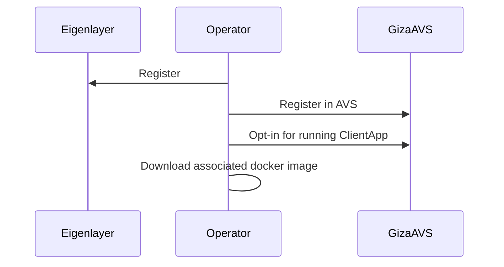
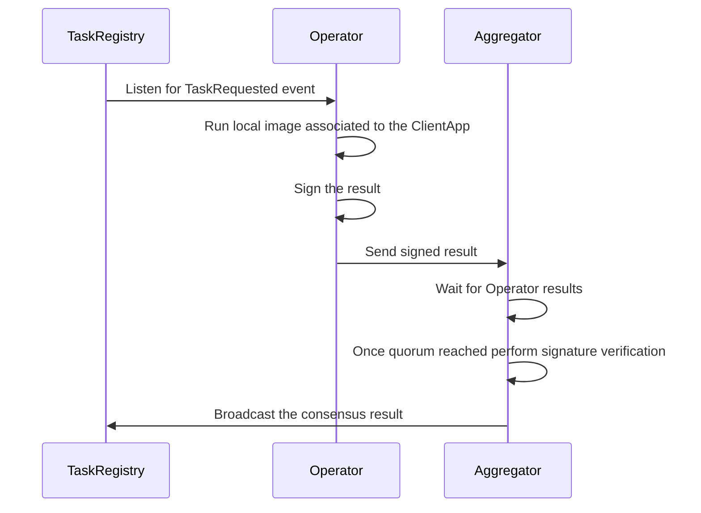

# What is Giza?

Giza is a decentralized protocol enabling AI-powered agents to operate within Web3 ecosystems. 
It provides infrastructure for creating, deploying, and running autonomous agents that interact with blockchain protocols and execute complex strategies.

Decentralized applications present significant challenges for users and developers. 
They require constant attention, frequent interactions, and deep technical knowledge, creating entry barriers, inefficiencies, and security risks.
The multitude of protocols and chains demands continuous monitoring to manage positions and optimize returns; a task beyond most users' capabilities. 
Moreover, the steep learning curve limits broader adoption, while managing cross-chain activities adds further complexity. 
Traditional smart contract-based automation, constrained by blockchain throughput and gas costs, falls short of addressing these issues comprehensively.

*Enter Giza Agents*

Giza Agents address these challenges by providing trustless automation of complex processes, enabling 24/7 monitoring and execution, and making Web3 more accessible, efficient, and engaging.

These autonomous software entities execute complex strategies, interact with multiple blockchain protocols, and make intelligent decisions based on real-time data and predefined algorithms. 
They can be customized for various use cases, from optimizing DeFi strategies to managing cross-chain operations, while maintaining transparency and trustlessness.

# Building Giza as an AVS

The Giza Protocol aims to provide decentralized execution, validation, and result verification of complex off-chain applications in a trust-minimized manner. We are building Giza as an AVS to leverage Ethereum's security for:

* **Decentralized execution**: Ensuring a distributed execution environment for Agents.
* **Decentralized validation and verification**: Ensuring user operations from Agents' executions are validated and verified across the network.
* **Trustless operations**: Implementing mechanisms that guarantee tamper resistance, preventing single-entity manipulation.

# AVSthon Scope

For the AVSthon, we have simplified the main components of the Giza protocol to deliver a functional proof of concept combining on-chain and off-chain components. The scope includes:

1. **Giza AVS** 
   
   - [GizaAvs](./contracts/src/GizaAvs.sol): Implements simplified Operator registration to the AVS.
   - [ClientAppRegistry](./contracts/src/ClientAppRegistry.sol): Handles registration of client applications.
   - [TaskRegistry](./contracts/src/TaskRegistry.sol): Manages task registration and Operator execution requests.
2. **Demo-App**
   
   - [DemoApp](./app/src/main.rs): A simple Rust executable that fetches the latest Ethereum block, packaged as a Docker image.
3. **Operator**
   
   - [Operator](./operator/src/main.rs): A Rust executable that monitors requested tasks, retrieves tasks to be run within the Demo-App Docker image, executes them, and forwards results to the Aggregator node.
4. **Aggregator**
   
   - [Aggregator](./aggregator/src/main.rs): A Rust executable that processes Operator results, verifies signatures, performs consensus validation, and broadcasts results to the `TaskRegistry`.


## Operator Registration

Two operators run on this AVS, both registered on Eigenlayer ([Operator 1](https://holesky.eigenlayer.xyz/operator/0x37893031A8484066232AcBE6bFe7E2a7A4411a7d) and [Operator 2](https://holesky.eigenlayer.xyz/operator/0x76cCAf70489a039947Fe104fe3Cc990f4270Aa5F)).
After Eigenlayer registration, Operators can register with GizaAVS using the `registerOperator` function. Once registered, Operators can opt-in to run the `DemoApp` by calling the `optInClientAppId` function.



## AVS Flow

When a task is requested, the `TaskRegistry` emits a `TaskRequested` event. 
Operators monitor these events and execute tasks using the associated Docker image. 
After execution, Operators send signed results to the Aggregator, which waits for a quorum before verifying signatures and broadcasting consensus results to the `TaskRegistry`.



## Design Decisions and Future Improvements

For the AVSthon, we wanted to build on lower level in order to understand the full eigenlayer picture, while we deployed an AVS using AltLayer (which by the way was a very simple and smooth process), for the submission we decided to manually integrate and deploy the contracts.
To maintain simplicity in this proof of concept while focusing on core off-chain/on-chain interactions, we simplified several components that will be enhanced in future iterations:

- **Operator Registration**: Currently simplified to basic Eigenlayer registration. Future versions will implement a `RegistryCoordinator` to verify Operator status before GizaAVS registration.
  
- **Operator Consensus**: Currently uses simple majority consensus. Future versions will implement more sophisticated consensus mechanisms for enhanced security.
  
- **Signature Scheme**: Currently uses ECDSA for simplicity. Future versions will implement BLS signatures for secure and efficient signature aggregation.

# Running the Code

## Prerequisites

The following tools are required:
- [Foundry](https://book.getfoundry.sh/getting-started/installation)
- [Rust toolchain](https://www.rust-lang.org/tools/install)
- [Colima](https://github.com/abiosoft/colima) -- On MacOS
- [Docker](https://www.docker.com/products/docker-desktop/) If not already installed

### Installing Foundry

```bash
curl -L https://foundry.paradigm.xyz | bash
foundryup
```

### Installing Rust

```bash
curl --proto '=https' --tlsv1.2 -sSf https://sh.rustup.rs | sh
```

### Installing Colima (If on MacOS)

```bash
brew install colima
colima start
```

### Installing Docker (If not already installed and on MacOS)

```bash
brew install docker
```

## Setup and Execution

You can run the AVS both locally using `anvil` or on Holesky testnet.

A `Makefile` is provided to ease the execution. Follow these steps in separate terminals:

### Local Execution

1. Start local blockchain: `make anvil`
1. Launch first Operator: `make run-operator-uji-anvil`
1. Launch second Operator: `make run-operator-floki-anvil`
1. Start Aggregator: `make run-aggregator-anvil`
1. Create a test task: `make create-task-anvil`

### Holesky Testnet

1. Launch first Operator: `make run-operator-uji-holesky`
1. Launch second Operator: `make run-operator-floki-holesky`
1. Start Aggregator: `make run-aggregator-holesky`
1. Create a test task: `make create-task-holesky`